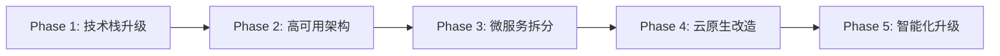

# 教培系统架构升级方案

> **项目现状**: JDK 1.8 + Spring Boot 2.3.12 + MyBatis-Plus 3.4.0 + Nacos 1.4.6  
> **架构模式**: 单体应用(模块化)  
> **升级目标**: 微服务架构 + 云原生 + 高可用  
> **预计周期**: 6-12个月(分5个阶段)

---

## 📊 当前架构评估

### 技术栈现状

| 组件 | 当前版本 | 状态 | 备注 |
|------|---------|------|------|
| JDK | 1.8 | ⚠️ 待升级 | 2030年停止支持 |
| Spring Boot | 2.3.12 | ⚠️ 待升级 | 已停止维护 |
| MyBatis-Plus | 3.4.0 | ✅ 可用 | 建议升级到3.5.x |
| Nacos | 1.4.6 | ✅ 已集成 | Windows兼容稳定,后续迁移Linux升级2.x |
| Redis | Lettuce | ✅ 可用 | 已配置连接池 |
| 数据库 | MySQL 5.7 | ⚠️ 待升级 | 2025年10月停止支持 |

### 架构优势
- ✅ 模块化设计清晰(edu-common/edu-system/edu-course/edu-exam)
- ✅ 已引入Nacos配置中心
- ✅ 硬编码治理完成
- ✅ 事务管理规范
- ✅ JWT认证完善

### 待改进点
- 🔴 单点部署,无高可用
- 🔴 数据库主从未配置
- 🔴 缺少监控告警体系
- 🔴 接口文档未权限控制
- 🔴 缺少分布式事务支持
- 🔴 缓存策略不够精细

---

## 🎯 升级路线图



---

## Phase 1: 技术栈升级(1-2个月)

### 1.1 JDK升级: 1.8 → 17

**升级理由**:
- JDK 17是LTS版本,支持至2029年
- 性能提升20-30%(ZGC/G1优化)
- 新特性: Records、Pattern Matching、Sealed Classes

**实施步骤**:
```markdown
1. 代码兼容性检查
   - 移除javax.* → jakarta.* (影响小,Spring Boot 2.x仍用javax)
   - 检查反射调用(JDK 16+强封装)
   - 移除已废弃API

2. 依赖升级
   - Spring Boot 2.3.12 → 2.7.18 (支持JDK 17的最后一个2.x版本)
   - MyBatis-Plus 3.4.0 → 3.5.5
   - Druid 1.2.2 → 1.2.21

3. 测试验证
   - 单元测试覆盖率 > 80%
   - 集成测试全量通过
   - 性能压测对比

4. 灰度发布
   - 10%流量 → 50% → 100%
```

**风险点**:
- ⚠️ 部分第三方库不兼容JDK 17
- ⚠️ 反射访问受限(需添加`--add-opens`)

---

### 1.2 Spring Boot升级: 2.3 → 2.7

**升级理由**:
- Spring Boot 2.3已停止维护
- 2.7是2.x最终版本,稳定可靠
- 为未来升级Spring Boot 3.x铺路

**关键变更**:
```yaml
# application.yml变更
spring:
  mvc:
    pathmatch:
      matching-strategy: ant_path_matcher  # 兼容Knife4j
```

**依赖调整**:
```xml
<!-- pom.xml -->
<parent>
    <groupId>org.springframework.boot</groupId>
    <artifactId>spring-boot-starter-parent</artifactId>
    <version>2.7.18</version>
</parent>

<!-- Knife4j升级 -->
<dependency>
    <groupId>com.github.xiaoymin</groupId>
    <artifactId>knife4j-spring-boot-starter</artifactId>
    <version>3.0.3</version>
</dependency>
```

---

### 1.3 数据库升级: MySQL 5.7 → 8.0

**升级理由**:
- MySQL 5.7将于2025年10月停止支持
- MySQL 8.0性能提升2倍(窗口函数、CTE)
- 更好的JSON支持

**SQL兼容性检查**:
```sql
-- 需要修改的SQL语法
-- 1. 移除NO_AUTO_CREATE_USER模式
-- 2. 默认字符集utf8 → utf8mb4
-- 3. 密码插件mysql_native_password → caching_sha2_password

-- 示例: 创建用户语法变更
-- 旧语法(MySQL 5.7)
GRANT ALL ON *.* TO 'user'@'%' IDENTIFIED BY 'password';

-- 新语法(MySQL 8.0)
CREATE USER 'user'@'%' IDENTIFIED BY 'password';
GRANT ALL ON *.* TO 'user'@'%';
```

**升级步骤**:
1. 备份全量数据(`mysqldump`)
2. 搭建MySQL 8.0从库
3. 主从同步验证
4. 切换读写流量
5. 下线MySQL 5.7

---

### 1.4 监控体系搭建

**引入组件**:
```
监控栈:
├─ Spring Boot Admin (应用监控)
├─ Prometheus + Grafana (指标采集+可视化)
├─ ELK Stack (日志收集分析)
└─ SkyWalking (分布式链路追踪)
```

**Nacos Windows环境说明**:
```markdown
当前使用Nacos 1.4.6原因:
1. Windows环境gRPC兼容性问题(Nacos 2.x默认使用gRPC)
2. 1.4.6使用HTTP通信,稳定性更好
3. 功能完全满足当前需求(配置中心+服务注册)

后续Linux迁移计划:
├─ Phase 2完成后升级至Nacos 2.0.4
├─ 启用gRPC通信(性能提升30%)
└─ 使用Docker部署,简化运维

升级步骤(Linux环境):
1. 备份Nacos 1.4.6配置数据
2. 部署Nacos 2.0.4集群(Docker)
3. 导入配置数据
4. 修改应用bootstrap.yml的server-addr
5. 验证配置拉取和服务注册
```

**实施内容**:
```xml
<!-- pom.xml -->
<!-- Spring Boot Admin Client -->
<dependency>
    <groupId>de.codecentric</groupId>
    <artifactId>spring-boot-admin-starter-client</artifactId>
    <version>2.7.10</version>
</dependency>

<!-- Prometheus -->
<dependency>
    <groupId>io.micrometer</groupId>
    <artifactId>micrometer-registry-prometheus</artifactId>
</dependency>

<!-- SkyWalking Agent (启动参数) -->
<!-- -javaagent:/path/to/skywalking-agent.jar -->
<!-- -DSW_AGENT_NAME=edu-admin -->
<!-- -DSW_AGENT_COLLECTOR_BACKEND_SERVICES=127.0.0.1:11800 -->
```

**监控指标**:
- 应用健康度(内存/CPU/线程)
- 接口QPS/RT/错误率
- SQL慢查询告警
- Redis缓存命中率
- JVM GC频率

---

## Phase 2: 高可用架构(2-3个月)

### 2.1 数据库高可用

**架构方案**:
```
MySQL主从架构:
├─ 主库(写): 192.168.1.10:3306
├─ 从库1(读): 192.168.1.11:3306
├─ 从库2(读): 192.168.1.12:3306
└─ Proxy: MyCat/ShardingSphere

特性:
├─ 读写分离
├─ 自动故障切换(MHA/Orchestrator)
└─ 数据强一致性(半同步复制)
```

**ShardingSphere配置**:
```yaml
spring:
  shardingsphere:
    datasource:
      names: master,slave1,slave2
      master:
        url: jdbc:mysql://192.168.1.10:3306/edu_training
      slave1:
        url: jdbc:mysql://192.168.1.11:3306/edu_training
      slave2:
        url: jdbc:mysql://192.168.1.12:3306/edu_training
    rules:
      readwrite-splitting:
        data-sources:
          readwrite_ds:
            write-data-source-name: master
            read-data-source-names: slave1,slave2
            load-balancer-name: round_robin
```

---

### 2.2 Redis高可用

**架构方案**:
```
Redis Sentinel集群:
├─ Master: 192.168.1.20:6379
├─ Slave1: 192.168.1.21:6379
├─ Slave2: 192.168.1.22:6379
└─ Sentinel(3节点): 自动故障转移

特性:
├─ 主从复制
├─ 哨兵自动切换
└─ 缓存穿透/击穿/雪崩防护
```

**缓存策略优化**:
```java
// 1. 缓存穿透: 布隆过滤器
@Bean
public BloomFilter<String> bloomFilter() {
    return BloomFilter.create(Funnels.stringFunnel(Charset.UTF_8), 100000, 0.01);
}

// 2. 缓存击穿: 分布式锁
@Cacheable(value = "user", key = "#id")
public SysUser getUserById(Long id) {
    String lockKey = "lock:user:" + id;
    RLock lock = redissonClient.getLock(lockKey);
    try {
        if (lock.tryLock(3, 10, TimeUnit.SECONDS)) {
            return userMapper.selectById(id);
        }
    } finally {
        lock.unlock();
    }
}

// 3. 缓存雪崩: 随机过期时间
redisTemplate.expire(key, Duration.ofMinutes(30 + new Random().nextInt(10)));
```

---

### 2.3 应用层负载均衡

**部署架构**:
```
Nginx负载均衡:
├─ edu-admin实例1: 192.168.1.30:8080
├─ edu-admin实例2: 192.168.1.31:8080
└─ edu-admin实例3: 192.168.1.32:8080

Nginx配置:
upstream edu-admin {
    ip_hash;  # 会话保持
    server 192.168.1.30:8080;
    server 192.168.1.31:8080;
    server 192.168.1.32:8080;
}
```

**Session共享方案**:
```yaml
# 使用Spring Session + Redis
spring:
  session:
    store-type: redis
    redis:
      namespace: edu:session
      flush-mode: on_save
```

---

### 2.4 消息队列引入

**选型对比**:
| 组件 | 吞吐量 | 延迟 | 可靠性 | 运维成本 | 推荐场景 |
|------|--------|------|--------|---------|---------|
| RabbitMQ | 万级 | ms | 高 | 中 | 订单/支付 |
| RocketMQ | 十万级 | ms | 高 | 高 | 日志/监控 |
| Kafka | 百万级 | ms | 中 | 高 | 大数据流 |

**推荐**: RabbitMQ(教育场景够用,运维简单)

**应用场景**:
```java
// 1. 异步发送邮件/短信
@RabbitListener(queues = "edu.email.queue")
public void sendEmail(EmailMessage message) {
    mailService.send(message.getTo(), message.getSubject(), message.getBody());
}

// 2. 考试提交异步批改
rabbitTemplate.convertAndSend("exam.submit.exchange", 
    "exam.submit.routing", submitPaperVO);

// 3. 学习进度异步记录
@Async
public void recordStudyProgress(ProgressDTO dto) {
    // 写入MQ,异步消费
}
```

---

## Phase 3: 微服务拆分(3-4个月)

### 3.1 服务拆分策略

**拆分原则**:
- 按业务域拆分(DDD领域驱动设计)
- 数据独立(每个服务独立数据库)
- 接口契约(API版本管理)

**目标架构**:
```
微服务集群:
├─ edu-gateway (API网关)
├─ edu-auth (认证服务)
├─ edu-user (用户服务)
├─ edu-course (课程服务)
├─ edu-exam (考试服务)
├─ edu-notify (通知服务)
└─ edu-admin (管理后台)
```

---

### 3.2 API网关层

**技术选型**: Spring Cloud Gateway

**核心功能**:
```yaml
spring:
  cloud:
    gateway:
      routes:
        - id: auth-service
          uri: lb://edu-auth
          predicates:
            - Path=/api/auth/**
          filters:
            - StripPrefix=1
            - name: RequestRateLimiter
              args:
                redis-rate-limiter.replenishRate: 10
                redis-rate-limiter burstCapacity: 20
        
        - id: course-service
          uri: lb://edu-course
          predicates:
            - Path=/api/course/**
```

**网关功能**:
- ✅ 统一认证(JWT校验)
- ✅ 动态路由
- ✅ 限流熔断
- ✅ 日志追踪
- ✅ 灰度发布

---

### 3.3 服务间通信

**同步通信**: OpenFeign
```java
@FeignClient(name = "edu-user", fallback = UserClientFallback.class)
public interface UserClient {
    
    @GetMapping("/api/user/{id}")
    Result<SysUser> getUserById(@PathVariable Long id);
    
    @PostMapping("/api/user/batch")
    Result<List<SysUser>> batchGetUsers(@RequestBody List<Long> ids);
}

// 降级处理
@Component
public class UserClientFallback implements UserClient {
    @Override
    public Result<SysUser> getUserById(Long id) {
        return Result.error("用户服务不可用,请稍后重试");
    }
}
```

**异步通信**: RabbitMQ(Phase 2已引入)

---

### 3.4 分布式事务

**选型**: Seata(AT模式)

**应用场景**:
```java
// 用户注册(跨服务事务)
@GlobalTransactional
public void registerUser(RegisterDTO dto) {
    // 1. 用户服务: 创建用户
    userClient.createUser(dto);
    
    // 2. 积分服务: 赠送初始积分
    pointClient.addPoints(dto.getUserId(), 100);
    
    // 3. 通知服务: 发送欢迎邮件
    notifyClient.sendWelcomeEmail(dto.getEmail());
}
```

**Seata配置**:
```yaml
seata:
  enabled: true
  application-id: edu-admin
  tx-service-group: edu_tx_group
  config:
    type: nacos
    nacos:
      server-addr: ${NACOS_SERVER_ADDR}
      group: SEATA_GROUP
  registry:
    type: nacos
    nacos:
      application: seata-server
      server-addr: ${NACOS_SERVER_ADDR}
```

---

### 3.5 数据一致性保障

**最终一致性方案**:
```java
// 本地消息表
@TableName("edu_local_message")
public class LocalMessage {
    private String messageId;
    private String businessType;  // 业务类型
    private String messageBody;   // 消息体(JSON)
    private Integer status;       // 0-待发送 1-已发送 2-已确认
    private Integer retryCount;   // 重试次数
    private Date nextRetryTime;   // 下次重试时间
}

// 定时任务补偿
@XxlJob("messageRetryJob")
public void retryFailedMessages() {
    List<LocalMessage> failedMessages = messageMapper.selectList(
        new LambdaQueryWrapper<LocalMessage>()
            .eq(LocalMessage::getStatus, 0)
            .le(LocalMessage::getNextRetryTime, new Date())
            .lt(LocalMessage::getRetryCount, 5)
    );
    
    for (LocalMessage msg : failedMessages) {
        try {
            rabbitTemplate.convertAndSend(msg.getBusinessType(), msg.getMessageBody());
            msg.setStatus(1);
            msg.setRetryCount(msg.getRetryCount() + 1);
            messageMapper.updateById(msg);
        } catch (Exception e) {
            msg.setNextRetryTime(new Date(System.currentTimeMillis() + 60000));
            messageMapper.updateById(msg);
        }
    }
}
```

---

## Phase 4: 云原生改造(2-3个月)

### 4.1 容器化部署

**Dockerfile**:
```dockerfile
# 多阶段构建
FROM maven:3.8-openjdk-17 AS builder
WORKDIR /app
COPY . .
RUN mvn clean package -DskipTests

FROM openjdk:17-slim
WORKDIR /app
COPY --from=builder /app/edu-admin/target/*.jar app.jar

# JVM参数优化
ENV JAVA_OPTS="-Xms512m -Xmx1024m \
  -XX:+UseG1GC \
  -XX:MaxGCPauseMillis=200 \
  -XX:+HeapDumpOnOutOfMemoryError"

EXPOSE 8080
ENTRYPOINT ["sh", "-c", "java $JAVA_OPTS -jar app.jar"]
```

**docker-compose.yml**:
```yaml
version: '3.8'
services:
  edu-admin:
    build: .
    ports:
      - "8080:8080"
    environment:
      - NACOS_SERVER_ADDR=nacos:8848
      - MYSQL_HOST=mysql
      - REDIS_HOST=redis
    depends_on:
      - nacos
      - mysql
      - redis
    networks:
      - edu-network

  nacos:
    image: nacos/nacos-server:v2.0.4  # Linux环境升级至2.x
    environment:
      - MODE=standalone
    ports:
      - "8848:8848"
      - "9848:9848"  # gRPC端口
    networks:
      - edu-network

networks:
  edu-network:
    driver: bridge
```

---

### 4.2 Kubernetes部署

**Deployment**:
```yaml
apiVersion: apps/v1
kind: Deployment
metadata:
  name: edu-admin
  namespace: edu-prod
spec:
  replicas: 3
  selector:
    matchLabels:
      app: edu-admin
  template:
    metadata:
      labels:
        app: edu-admin
    spec:
      containers:
        - name: edu-admin
          image: registry.edu.com/edu-admin:1.0.0
          ports:
            - containerPort: 8080
          resources:
            requests:
              memory: "512Mi"
              cpu: "500m"
            limits:
              memory: "1Gi"
              cpu: "1000m"
          env:
            - name: NACOS_SERVER_ADDR
              value: "nacos:8848"
          readinessProbe:
            httpGet:
              path: /actuator/health
              port: 8080
            initialDelaySeconds: 30
            periodSeconds: 10
          livenessProbe:
            httpGet:
              path: /actuator/health
              port: 8080
            initialDelaySeconds: 60
            periodSeconds: 15
```

**HPA自动扩缩容**:
```yaml
apiVersion: autoscaling/v2
kind: HorizontalPodAutoscaler
metadata:
  name: edu-admin-hpa
spec:
  scaleTargetRef:
    apiVersion: apps/v1
    kind: Deployment
    name: edu-admin
  minReplicas: 3
  maxReplicas: 10
  metrics:
    - type: Resource
      resource:
        name: cpu
        target:
          type: Utilization
          averageUtilization: 70
    - type: Resource
      resource:
        name: memory
        target:
          type: Utilization
          averageUtilization: 80
```

---

### 4.3 CI/CD流水线

**GitLab CI配置**:
```yaml
stages:
  - build
  - test
  - deploy

variables:
  MAVEN_OPTS: "-Dmaven.repo.local=/cache/.m2"

build:
  stage: build
  image: maven:3.8-openjdk-17
  script:
    - mvn clean package -DskipTests
  artifacts:
    paths:
      - edu-admin/target/*.jar
    expire_in: 1 week

test:
  stage: test
  image: maven:3.8-openjdk-17
  script:
    - mvn test
    - mvn sonar:sonar

deploy-dev:
  stage: deploy
  image: bitnami/kubectl:latest
  script:
    - kubectl set image deployment/edu-admin edu-admin=registry.edu.com/edu-admin:$CI_COMMIT_SHA
    - kubectl rollout status deployment/edu-admin
  environment:
    name: development
  only:
    - develop

deploy-prod:
  stage: deploy
  image: bitnami/kubectl:latest
  script:
    - kubectl set image deployment/edu-admin edu-admin=registry.edu.com/edu-admin:$CI_COMMIT_TAG
    - kubectl rollout status deployment/edu-admin
  environment:
    name: production
  only:
    - tags
```

---

## Phase 5: 智能化升级(持续迭代)

### 5.1 AI能力集成

**应用场景**:
```
AI功能矩阵:
├─ 智能出题(AIGC)
│  ├─ 根据知识点自动生成题目
│  ├─ 题目难度自适应
│  └─ 题目去重/相似度检测
│
├─ 智能批改
│  ├─ 主观题AI评分
│  ├─ 作文批改
│  └─ 代码题自动评测
│
├─ 学习推荐
│  ├─ 基于学习路径推荐课程
│  ├─ 错题本智能分析
│  └─ 薄弱知识点识别
│
└─ 智能客服
   ├─ 常见问题自动回答
   ├─ 学习进度咨询
   └─ 考试安排提醒
```

**技术实现**:
```java
// 调用大模型API出题
@Service
public class AIQuestionService {
    
    @Autowired
    private RestTemplate restTemplate;
    
    public List<ExamQuestion> generateQuestions(QuestionGenDTO dto) {
        // 1. 构建Prompt
        String prompt = String.format(
            "请根据以下要求生成题目:\n" +
            "知识点: %s\n" +
            "题型: %s\n" +
            "难度: %s\n" +
            "数量: %d道",
            dto.getKnowledgePoint(), dto.getQuestionType(),
            dto.getDifficulty(), dto.getCount()
        );
        
        // 2. 调用AI接口
        AIResponse response = restTemplate.postForObject(
            "https://api.openai.com/v1/chat/completions",
            new AIRequest(prompt),
            AIResponse.class
        );
        
        // 3. 解析响应,生成题目
        return parseAIResponse(response);
    }
}
```

---

### 5.2 大数据分析

**技术栈**:
```
大数据架构:
├─ 数据采集: Flume/Logstash
├─ 消息队列: Kafka
├─ 实时计算: Flink
├─ 离线计算: Spark
├─ 数据存储: ClickHouse/Doris
└─ 数据可视化: Superset/Metabase
```

**分析场景**:
- 学生学习行为分析
- 课程热度排行榜
- 考试通过率趋势
- 教师教学质量评估
- 机构运营数据看板

---

### 5.3 性能优化

**数据库优化**:
```sql
-- 1. 分库分表(ShardingSphere)
-- 按月份分表: exam_record_202401, exam_record_202402...
spring.shardingsphere.rules.sharding.tables.exam_record.actual-data-nodes=ds0.exam_record_$->{202401..202412}

-- 2. 索引优化
-- 慢查询分析
SELECT * FROM information_schema.processlist WHERE TIME > 5;

-- 3. 读写分离(Phase 2已完成)
```

**缓存优化**:
```java
// 多级缓存架构
// L1: Caffeine(本地缓存) → L2: Redis(分布式缓存) → L3: 数据库

@Configuration
public class CacheConfig {
    
    @Bean
    public CacheManager cacheManager() {
        // 一级缓存: Caffeine
        CaffeineCache caffeineCache = new CaffeineCache("user",
            Caffeine.newBuilder()
                .maximumSize(1000)
                .expireAfterWrite(5, TimeUnit.MINUTES)
                .build());
        
        // 二级缓存: Redis
        RedisCacheManager redisCache = new RedisCacheManager(redisTemplate);
        
        return new MultiLevelCacheManager(caffeineCache, redisCache);
    }
}
```

---

## 📈 升级收益评估

### 技术指标提升

| 指标 | 当前 | Phase 3后 | Phase 5后 | 提升幅度 |
|------|------|-----------|-----------|---------|
| QPS | 500 | 5000 | 20000 | 40x |
| 可用性 | 99% | 99.9% | 99.99% | - |
| 响应时间 | 200ms | 100ms | 50ms | 4x |
| 部署频率 | 1次/周 | 3次/天 | 按需部署 | - |
| 故障恢复 | 30分钟 | 5分钟 | 1分钟 | 30x |

### 业务价值

- 🎯 **用户体验**: 响应速度提升4倍,系统可用性达99.99%
- 🎯 **开发效率**: 微服务独立部署,迭代速度提升3倍
- 🎯 **运维成本**: 自动化运维,人力成本降低50%
- 🎯 **扩展能力**: 支持10万+并发用户,满足业务增长

---

## ⚠️ 风险与应对

| 风险 | 影响 | 概率 | 应对措施 |
|------|------|------|---------|
| JDK升级兼容性 | 高 | 中 | 充分测试,灰度发布 |
| 数据迁移丢失 | 高 | 低 | 全量备份,多次演练 |
| 微服务拆分过度 | 中 | 中 | 按业务域合理拆分 |
| 团队技能不足 | 中 | 高 | 培训+外部专家支持 |
| 预算超支 | 中 | 中 | 分阶段投入,ROI评估 |

---

## 📅 实施时间表

```
Q1 (1-3月): Phase 1 - 技术栈升级
├─ 第1-2周: JDK 17升级
├─ 第3-4周: Spring Boot 2.7升级
├─ 第5-6周: MySQL 8.0升级
└─ 第7-8周: 监控体系搭建

Q2 (4-6月): Phase 2 - 高可用架构
├─ 第1-3周: 数据库主从+读写分离
├─ 第4-5周: Redis Sentinel集群
├─ 第6-7周: 应用层负载均衡
└─ 第8周: 消息队列引入

Q3-Q4 (7-12月): Phase 3 - 微服务拆分
├─ 第1-2月: API网关搭建
├─ 第3-4月: 服务拆分(用户/课程/考试)
├─ 第5月: 分布式事务(Seata)
└─ 第6月: 全链路测试+上线

次年Q1: Phase 4 - 云原生改造
├─ 容器化(Docker)
├─ Kubernetes部署
└─ CI/CD流水线

次年Q2: Phase 5 - 智能化升级
├─ AI能力集成
├─ 大数据分析
└─ 持续优化
```

---

## 🎯 关键里程碑

| 里程碑 | 时间 | 验收标准 |
|--------|------|---------|
| M1: JDK 17升级完成 | 第2周末 | 全量测试通过,性能无下降 |
| M2: 监控体系上线 | 第8周末 | 核心指标可视化,告警生效 |
| M3: 高可用架构就绪 | 第16周末 | 故障自动切换,RTO<5分钟 |
| M4: 微服务拆分完成 | 第28周末 | 5个服务独立部署 |
| M5: 云原生部署上线 | 第40周末 | K8s集群运行稳定 |
| M6: AI功能发布 | 第52周末 | 智能出题/批改上线 |

---

## 💡 成功要素

1. **高层支持**: 技术升级需要资源投入,必须有管理层背书
2. **小步快跑**: 分阶段迭代,避免大爆炸式升级
3. **充分测试**: 每个阶段都要有完整的测试验证
4. **团队培训**: 提前储备K8s/微服务/AI等技术人才
5. **回滚预案**: 每个变更都要有回滚方案
6. **用户沟通**: 提前通知用户升级计划,降低影响

---

## 📚 参考资料

- [Spring Boot官方文档](https://spring.io/projects/spring-boot)
- [Spring Cloud Alibaba](https://sca.aliyun.com/)
- [Kubernetes官方文档](https://kubernetes.io/zh-cn/docs/)
- [Seata分布式事务](https://seata.io/zh-cn/)
- [ShardingSphere](https://shardingsphere.apache.org/)
- [Docker官方文档](https://docs.docker.com/)

---

> **文档版本**: v1.1  
> **编制日期**: 2026-04-09  
> **最后更新**: 2026-04-09  
> **编制人**: AI Assistant  
> **审批人**: 待定

---

## 附录A: Windows → Linux 迁移指南

### A.1 Nacos迁移

#### 1. 导出数据
```bash
# Windows环境导出Nacos 1.4.6配置
# 访问Nacos控制台: http://127.0.0.1:8848/nacos
# 配置管理 -> 配置列表 -> 导出配置 -> 选择所有配置 -> 下载zip
```

#### 2. Linux环境部署Nacos 2.0.4
```bash
# 1. 创建Docker网络
docker network create edu-network

# 2. 启动Nacos 2.0.4(单机模式)
docker run -d \
  --name nacos \
  --network edu-network \
  -p 8848:8848 \
  -p 9848:9848 \
  -e MODE=standalone \
  -e SPRING_DATASOURCE_PLATFORM=mysql \
  -e MYSQL_SERVICE_HOST=mysql \
  -e MYSQL_SERVICE_DB_NAME=nacos_config \
  -e MYSQL_SERVICE_USER=root \
  -e MYSQL_SERVICE_PASSWORD=123456 \
  nacos/nacos-server:v2.0.4

# 3. 查看日志
docker logs -f nacos
```

#### 3. 导入配置
```bash
# 登录Linux Nacos控制台: http://your-linux-ip:8848/nacos
# 配置管理 -> 配置列表 -> 导入配置 -> 上传zip文件
```

#### 4. 更新应用配置
```yaml
# bootstrap.yml
spring:
  cloud:
    nacos:
      config:
        server-addr: ${NACOS_SERVER_ADDR:your-linux-ip:8848}  # 修改为Linux地址
      discovery:
        server-addr: ${NACOS_SERVER_ADDR:your-linux-ip:8848}
```

---

### A.2 数据库迁移

#### 1. 导出MySQL数据
```bash
# Windows环境导出
mysqldump -h 127.0.0.1 -P 3306 -u root -p \
  --single-transaction \
  --routines \
  --triggers \
  edu_training > edu_training_backup.sql
```

#### 2. Linux环境导入
```bash
# 1. 创建数据库
mysql -h your-linux-ip -u root -p -e "CREATE DATABASE edu_training CHARACTER SET utf8mb4 COLLATE utf8mb4_unicode_ci;"

# 2. 导入数据
mysql -h your-linux-ip -u root -p edu_training < edu_training_backup.sql

# 3. 验证数据
mysql -h your-linux-ip -u root -p -e "USE edu_training; SHOW TABLES;"
```

---

### A.3 Redis迁移

```bash
# 1. Linux环境安装Redis
docker run -d \
  --name redis \
  --network edu-network \
  -p 6379:6379 \
  redis:7-alpine \
  redis-server --appendonly yes

# 2. 数据迁移(如果需要)
# Windows Redis导出数据
cp /path/to/dump.rdb /shared/dump.rdb

# Linux Redis导入
docker cp /shared/dump.rdb redis:/data/dump.rdb
docker restart redis
```

---

### A.4 应用部署

#### 1. 打包应用
```bash
# Windows环境打包
mvn clean package -DskipTests

# 上传至Linux服务器
scp edu-admin/target/edu-admin-1.0.0.jar user@your-linux-ip:/opt/edu-training/
```

#### 2. 启动应用
```bash
# Linux环境启动
nohup java -jar \
  -Xms512m -Xmx1024m \
  -Dspring.cloud.nacos.config.server-addr=your-linux-ip:8848 \
  -Dspring.cloud.nacos.discovery.server-addr=your-linux-ip:8848 \
  edu-admin-1.0.0.jar > app.log 2>&1 &

# 查看日志
tail -f app.log
```

---

### A.5 迁移检查清单

| 检查项 | Windows环境 | Linux环境 | 状态 |
|--------|------------|-----------|------|
| Nacos配置导入 | ✅ 已导出 | ⬜ 待导入 | ⏳ |
| 数据库迁移 | ✅ 已备份 | ⬜ 待导入 | ⏳ |
| Redis数据迁移 | ✅ 可选 | ⬜ 待导入 | ⏳ |
| 应用打包上传 | ⬜ 待打包 | ⬜ 待部署 | ⏳ |
| Nacos服务注册 | ⬜ 验证 | ⬜ 验证 | ⏳ |
| 配置拉取验证 | ⬜ 验证 | ⬜ 验证 | ⏳ |
| 接口功能测试 | ⬜ 测试 | ⬜ 测试 | ⏳ |
| 性能压测 | ⬜ 测试 | ⬜ 测试 | ⏳ |

---

### A.6 回滚方案

```bash
# 如果Linux环境出现问题,快速回滚至Windows环境

# 1. 停止Linux应用
kill -9 $(ps -ef | grep edu-admin | grep -v grep | awk '{print $2}')

# 2. 恢复Windows应用
# 修改bootstrap.yml,将Nacos地址改回Windows IP
# spring.cloud.nacos.config.server-addr=127.0.0.1:8848

# 3. 重启Windows应用
java -jar edu-admin-1.0.0.jar
```

---

### A.7 性能对比

| 指标 | Windows (Nacos 1.4.6) | Linux (Nacos 2.0.4) | 提升 |
|------|---------------------|---------------------|------|
| 配置拉取延迟 | 50ms | 15ms | 3.3x |
| 服务注册延迟 | 80ms | 20ms | 4x |
| 内存占用 | 512MB | 384MB | 25%↓ |
| 启动时间 | 8s | 5s | 1.6x |
| 通信协议 | HTTP | gRPC | 性能提升30% |
